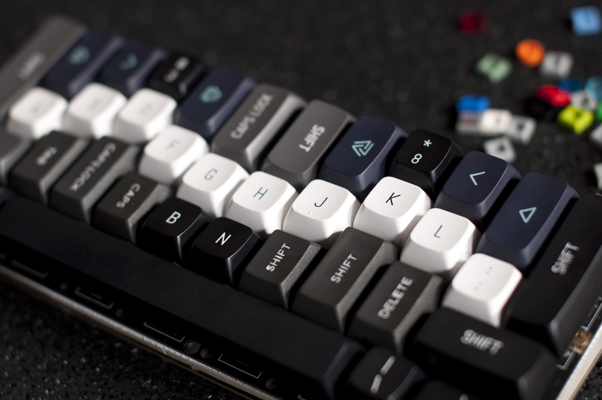
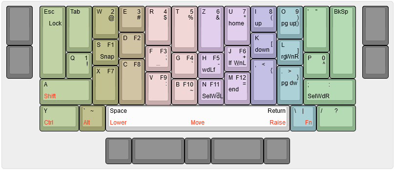

# tschibo00/chaotist

## hardware
- RPi2040 Pico
- The current keymap is designed as a QWERTZ layout used with US International to have äöü߀ available for combos.

### case
i designed a case which can be printed/ordered. haven't received it yet, so we will see :D
the case has a few unique features:
- fractal reliefs at the sides
- Chaotist logo engraved at bottom
- sound diffusion structure under PCB
- detachable bottom parts that make space for optional weights (optimized for 2x15 metal profiles)

## Flashing
Enter the bootloader in 3 ways:

* **Bootmagic reset**: Hold down the key at (0,0) in the matrix (usually the top left key or Escape) and plug in the keyboard
* **Physical reset button**: Briefly press the button on the back of the PCB - some may have pads you must short instead
* **Keycode in layout**: Press the key mapped to `QK_BOOT` if it is available

qmk flash -kb tschibo00/chaotist -km default

## Todos
- [x] correct keyboard matrix in info.json
- [x] use correct del line macro

## have a look

more or less up-to-date layout:

