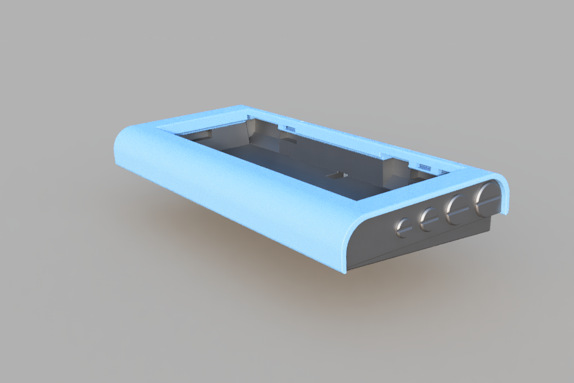
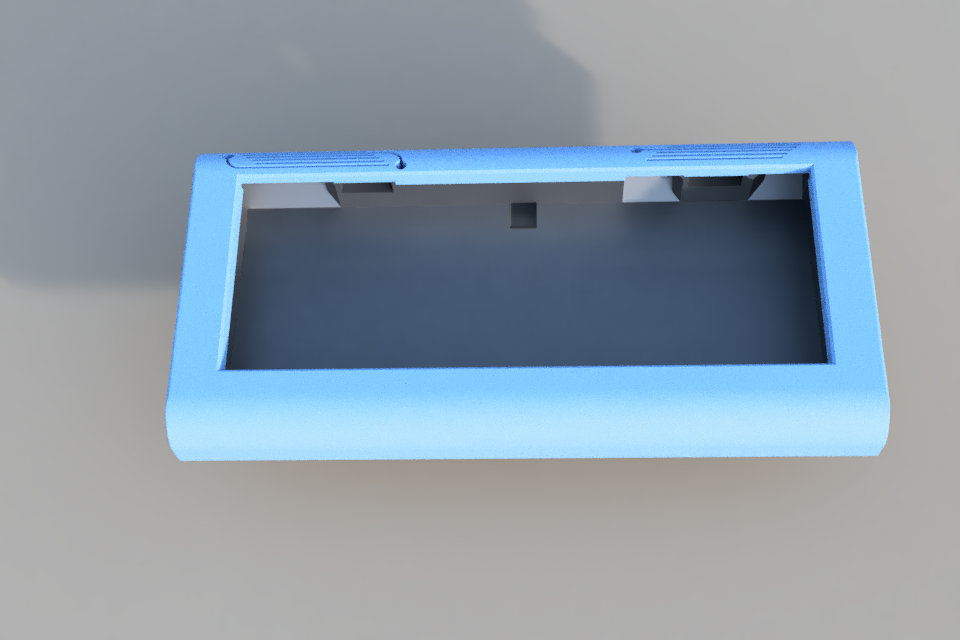
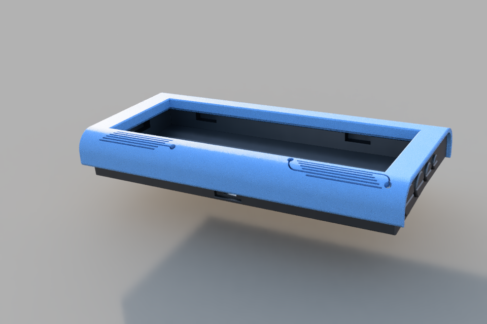
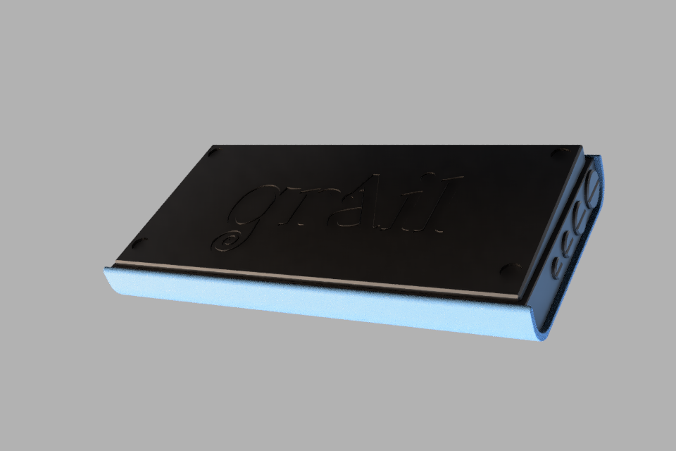
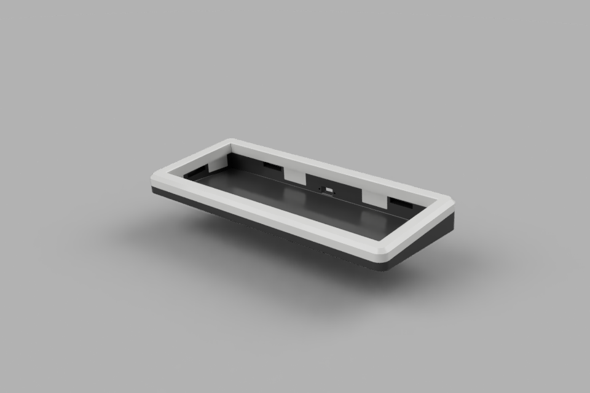
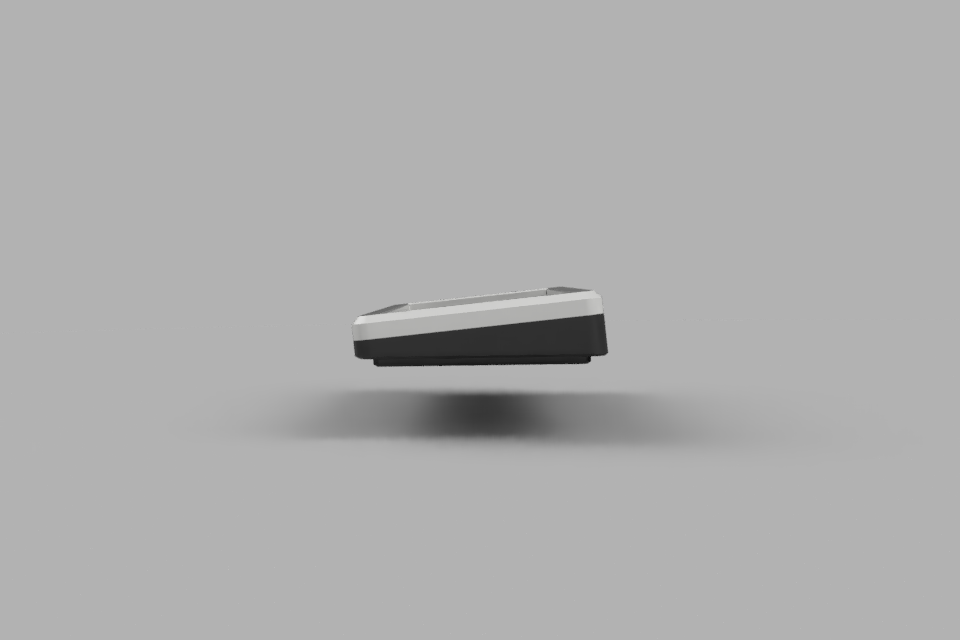
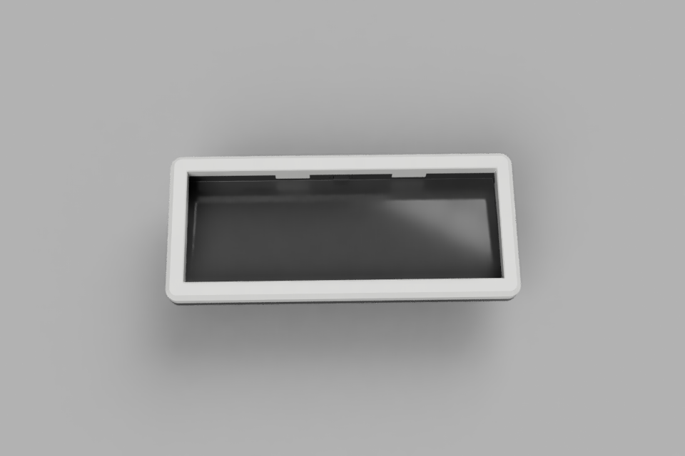
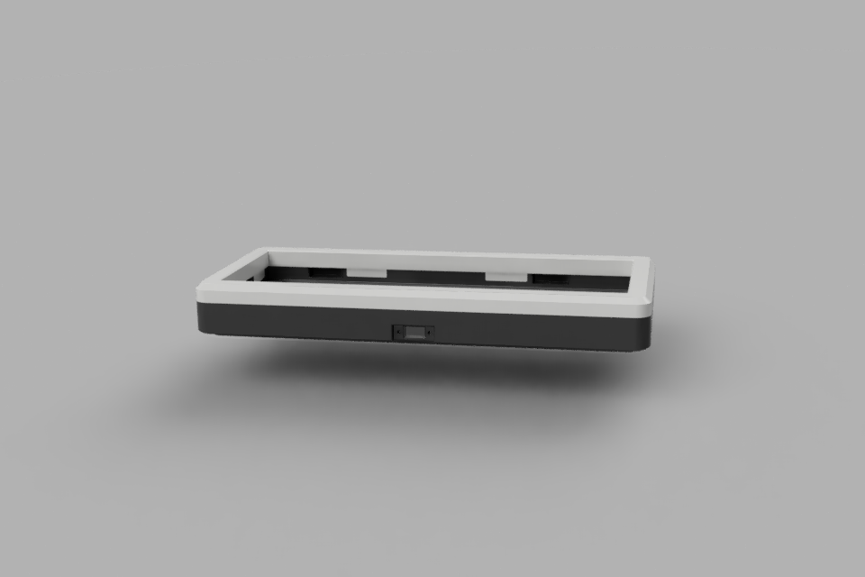

There are 2 different cases for the grAIl, ready for printing (already printed but not yet painted)

Both cases consist of a top and a bottom file, the halves attach to each other with friction, no screws required.
In the unpainted state it doesn't hold too tight, will see how it's painted.

## Teleprinter style, using space age design elements

## Simple chamfered

## Special artisan keycap, designed based on AI-generated images as inspiration.

