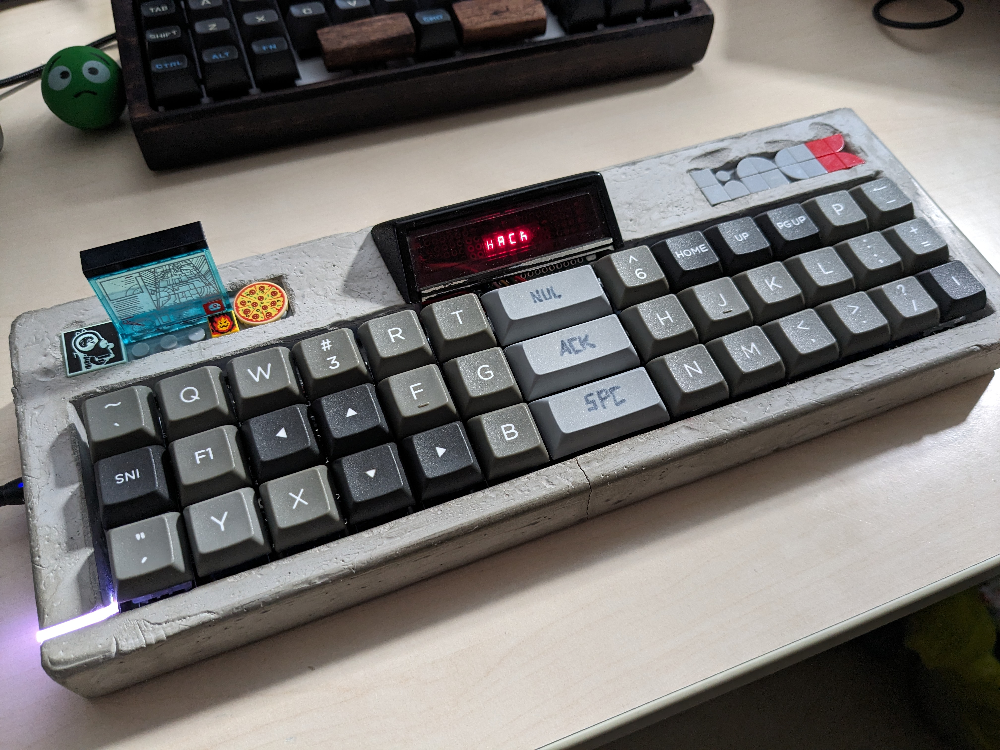
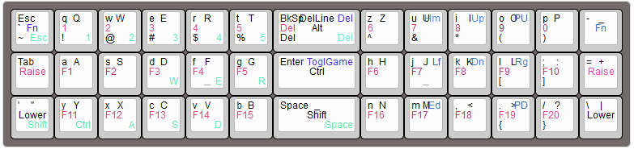

# tschibo00/planklet

## WARNING
This project is a personal project, i just built one prototype. It's not considered complete, nor tested or error-free.

I won't develop this much, just releasing it as-is for anybody knowledgable picking up and maybe building upon it.

It is NOT ready to take the files and produce a working keyboard!

## What is it?

Ortho 3x13 layout with 2u in the middle column. Tailored to my very specific needs like having a bit more space and a super-special gaming layer which fits my hand positioning.

Added one backlight/sidelight WS2812 and a 5-digit 7-segment display from and old HP calculator for funsies.

## hardware
- RPi2040 Pico
- single WS2812 
- HP 1990-0335 display from a broken HP-35 calculator probably from 1975
  - the display is driven in an unconventional way by charlie-plexing with an IS31FL3731 (i wanted to use I2C and that was the best bet - at least it seemed so at first sight)
### the charlie-plexed display
Initially i thought it would be solvable by software, however the hardware poses certain limitations, esp. for each digit one segment is not addressable - and it has to be a different one for each digit :(
So through a lot of experimenting and sketching i figured i could use the display upside down and utilize the decimal dot inside the digits.

In the current version 4 of the 5 available digits are used as follows:
- The common segment anodes are connected as follows
  - a - A3
  - b - A7
  - c - A1
  - d - A8
  - e - A5
  - f - A6
  - g - A2
  - DP- A4
- The common cathodes are connected to the B pins to decouple them at least to some extent from the charlie-plexing which is genuinely not suitable for this kind of display :)
  - digit 2 - B5
  - digit 3 - B2
  - digit 4 - B3
  - digit 5 - B4
 
when viewed upside down this leads to the following segment not being usable (looked as if a would be uppermost segment, while on the chip it's segment d) - leftmost digit named 1 even though on the chip it's digit 5
- digit 1: segment DP
- digit 2: segment d
- digit 3: segment g
- digit 4: segment b

The software does the conversion, therefore the patterns can be defined in a human-readable way, see hp_display.c for details

## Flashing
Enter the bootloader in 3 ways:

* **Bootmagic reset**: Hold down the key at (0,0) in the matrix (usually the top left key or Escape) and plug in the keyboard
* **Physical reset button**: Briefly press the button on the back of the PCB - some may have pads you must short instead
* **Keycode in layout**: Press the key mapped to `QK_BOOT` if it is available

qmk flash -kb tschibo00/planklet -km default

## Todos
- [x] use correct space/underscore solution of bm40
- [x] solve mod tap with esc, MC_DEL for del/backsp and ' "
- [ ] find better solution for RGB light to store settings for both layers
- [x] add win left/right
- [x] fix buggy/flaky display update
- [ ] add more animation effects in game mode
- [ ] add more fancy macros

~~- [ ] set pwm of all segments in init~~

## have a look

more or less up-to-date layout:

