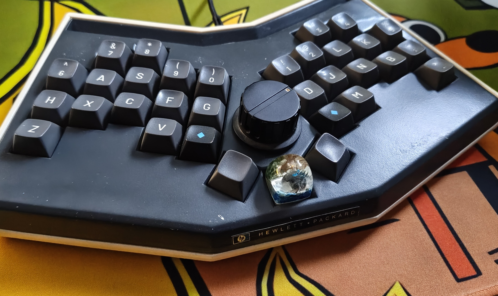

# ToKeyO Plus

## WARNING
This project is a personal project, i just built one prototype. It's not considered complete, nor tested or error-free.

I won't develop this much, just releasing it as-is for anybody knowledgable picking up and maybe building upon it.

It is NOT ready to take the files and produce a working keyboard!

## What is it?

This is basically an evolution of the ToKeyO keyboard, as I'm only using 3 thumb keys instead of the original 5.

Also the placement of the thumb keys is a little bit modified. The left and right thumb key also supports 1.25u and 1.5u.

Biggest change is the addition of an encoder for scrolling (or whatever you want to use it for).

The footprint supports MX, ChocV1 and Alps.

The case is a friction-mounted case which allows for dampening below the PCB and has a cutout for 19mm knobs.

