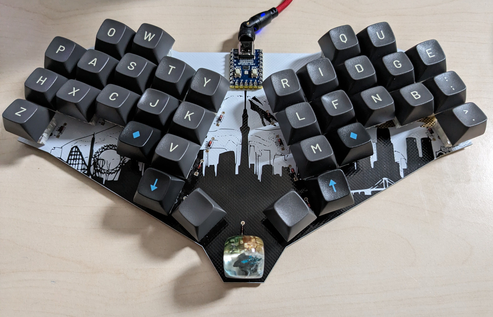

# tschibo00/tokeyo

## WARNING
This project is a personal project, i just built one prototype. It's not considered complete, nor tested or error-free.

I won't develop this much, just releasing it as-is for anybody knowledgable picking up and maybe building upon it.

It is NOT ready to take the files and produce a working keyboard!

## hardware
- RPi2040 Zero
- The current keymaps is designed as Colemak DH layout used with US International to have äöü߀ available for combos.

## Flashing
Enter the bootloader in 3 ways:

* **Bootmagic reset**: Hold down the key at (0,0) in the matrix (usually the top left key or Escape) and plug in the keyboard
* **Physical reset button**: Briefly press the button on the back of the PCB - some may have pads you must short instead
* **Keycode in layout**: Press the key mapped to `QK_BOOT` if it is available

qmk flash -kb tschibo00/tokeyo -km default

## have a look

# Todos
- [x] correct keyboard matrix in info.json
- [x] use correct del line macro
- [x] add macros from other code
- [x] add colemak dh
- [x] make better use of function layer
- [x] think about utilizing move layer better
- [x] move escape somewhere else to avoid accidental presses
- [x] add case file with build instructions
- [x] move more critical commands like boot to a special layer thats not triggered accidentally
- [-] try to use space/underscore again
- [x] add audio layer
- [x] add repeat on delete
- [x] add missing symbols like percent, angled brackets
- [x] use magic key as leader key and hold for shift
- [x] switch ; and : in base layer (or think of a better way to use the key :D)
- [-] make layer switch permanent, when combined with leader key. switch back to base layer on next leader key press
- [x] add window move left/right
- [x] cleanup QK_LEAD vs MC_LEAD
- [x] add Alt key
- [x] add magic keys for opening apps
- [x] move graphic on top silk layer to center
- [x] move credits on front to a visible area when switches are soldered
- [x] fix copper horizon on back
- [x] add delete line macro
- [x] add clipboard stuff to nav layer
- [ ] rework unused nav layer stuff
- [x] add mounting points
- [x] fine tune placement of thumb cluster
- [x] fix shift timing
- [x] add shortcut to double the current line as commented out
- [x] dot+comma shifted on numsym layer
- [x] alt+win+k mute/unmute
- [x] add del word as combo again
- [x] add mongo snippets

- [ ] make BRMs work with F-keys
