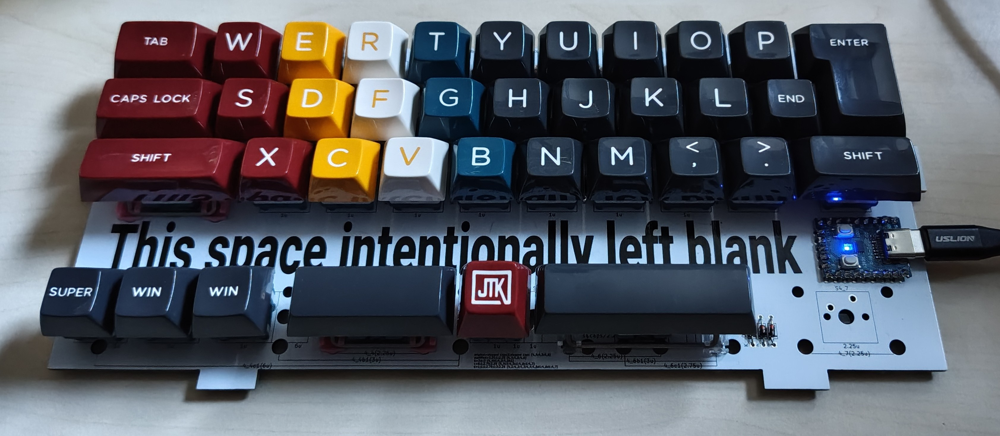

# tschibo00/typist

## WARNING
This project is a personal project, i just built one prototype. It's not considered complete, nor tested or error-free.

I won't develop this much, just releasing it as-is for anybody knowledgable picking up and maybe building upon it.

It is NOT ready to take the files and produce a working keyboard!

## What is it?

Slightly wider weird qaz like layout with ISO Enter.
The keyboard is gasket mounted.

## hardware
- RPi2040 Zero

## BOM
- PCB
- RPi2040 Zero
- 33-37 diodes, e.g. 1N4148
- 33-37 key switches of your liking
- 33-37 key caps
- if gasket mounting in a case:
    - 4 rubber pads 9.5mm diameter
    - USB port extension
    - 5x3mm self-adhesive sealing tape for the gasket mount
    - bottom case printed
    - top case printed
    - paint to your likings :)
    - optional: dampening (I use cork in case bottom)

## Rough build instructions
- solder the diodes on top
- solder the RPi on top
- solder the switches on top
- if gasket mounting in a case:
    - mount USB extension cable and fix it inside the case
    - add the sealing tape to the gaskets from all sides
    - insert PCB into case bottom
    - attach USB extension

## Todos

